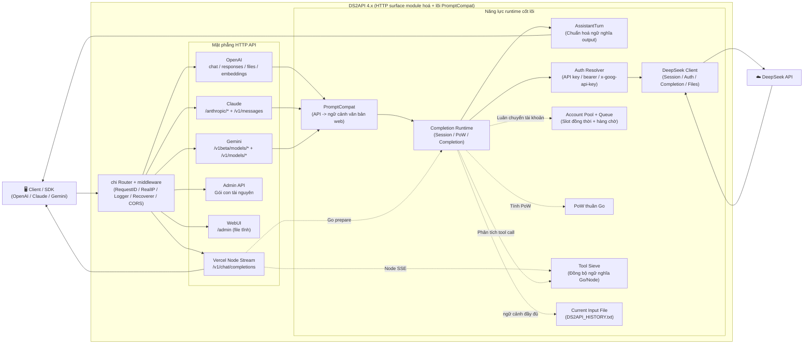

<p align="center">
  
</p>

# DS2API (bản dịch tiếng Việt)

[](LICENSE)


[](https://github.com/CJackHwang/ds2api/releases)
[](docs/DEPLOY.md)

Ngôn ngữ / Language: [Tiếng Việt](README.vi.md) | [中文](README.MD) | [English](README.en.md)

Chuyển đổi khả năng đối thoại của DeepSeek Web thành các API tương thích **OpenAI, Claude và Gemini**. Backend lõi viết bằng **Go**; phần streaming bridge trên Vercel có dùng thêm một ít Node Runtime; frontend là bảng quản trị React WebUI (mã nguồn ở `webui/`, khi triển khai sẽ tự build vào `static/admin`).

Tài liệu liên quan: [README gốc tiếng Trung](README.MD) · [README tiếng Anh](README.en.md) · [Hướng dẫn triển khai](docs/DEPLOY.md) · [Tài liệu API](API.md)

> **Tuyên bố miễn trừ trách nhiệm quan trọng**
>
> Repository này chỉ phục vụ mục đích học tập, nghiên cứu, thử nghiệm cá nhân và kiểm thử nội bộ; không cấp bất kỳ giấy phép thương mại nào, không đảm bảo tính phù hợp hay đảm bảo kết quả.
>
> Tác giả và người duy trì repository không chịu trách nhiệm cho bất kỳ tổn thất trực tiếp hay gián tiếp, bị khoá tài khoản, mất dữ liệu, rủi ro pháp lý hay khiếu kiện từ bên thứ ba phát sinh do việc sử dụng, sửa đổi, phân phối, triển khai hoặc phụ thuộc dự án này.
>
> Vui lòng không sử dụng dự án vào các tình huống vi phạm điều khoản dịch vụ, thoả thuận, pháp luật hoặc quy tắc nền tảng. Trước khi sử dụng thương mại, bạn phải tự xác nhận `LICENSE`, các thoả thuận liên quan và đã được tác giả cấp phép bằng văn bản.

## Mục lục

- [Tổng quan kiến trúc (tóm tắt)](#tổng-quan-kiến-trúc-tóm-tắt)
- [Năng lực cốt lõi](#năng-lực-cốt-lõi)
- [Ma trận tương thích nền tảng](#ma-trận-tương-thích-nền-tảng)
- [Mô hình hỗ trợ](#mô-hình-hỗ-trợ)
- [Bắt đầu nhanh](#bắt-đầu-nhanh)
- [Cấu hình](#cấu-hình)
- [Chế độ xác thực](#chế-độ-xác-thực)
- [Mô hình đồng thời](#mô-hình-đồng-thời)
- [Tool Call](#tool-call)
- [Công cụ bắt gói tin khi phát triển cục bộ](#công-cụ-bắt-gói-tin-khi-phát-triển-cục-bộ)
- [Chỉ mục tài liệu](#chỉ-mục-tài-liệu)
- [Kiểm thử](#kiểm-thử)
- [Tự động build Release (GitHub Actions)](#tự-động-build-release-github-actions)
- [Miễn trừ trách nhiệm](#miễn-trừ-trách-nhiệm)

## Tổng quan kiến trúc (tóm tắt)



Phân tích kiến trúc chi tiết và trách nhiệm thư mục: xem [docs/ARCHITECTURE.md](docs/ARCHITECTURE.md).

- **Backend**: Go (`cmd/ds2api/`, `api/`, `internal/`), không phụ thuộc runtime Python
- **Frontend**: Bảng quản trị React (`webui/`), runtime phục vụ artifact build tĩnh
- **Triển khai**: Chạy cục bộ, Docker, Vercel Serverless, Linux systemd

## Năng lực cốt lõi

| Năng lực | Mô tả |
| --- | --- |
| Tương thích OpenAI | `GET /v1/models`, `GET /v1/models/{id}`, `POST /v1/chat/completions`, `POST /v1/responses`, `GET /v1/responses/{response_id}`, `POST /v1/embeddings`, `POST /v1/files`, `GET /v1/files/{file_id}` |
| Tương thích Claude | `GET /anthropic/v1/models`, `POST /anthropic/v1/messages`, `POST /anthropic/v1/messages/count_tokens` (cùng đường tắt `/v1/messages`, `/messages`) |
| Tương thích Gemini | `POST /v1beta/models/{model}:generateContent`, `POST /v1beta/models/{model}:streamGenerateContent` (cùng đường `/v1/models/{model}:*`) |
| CORS thống nhất | `/v1/*`, `/anthropic/*`, `/v1beta/models/*`, `/admin/*` dùng chung một bộ chính sách CORS; trên Vercel, Node Runtime cho `/v1/chat/completions` cũng dùng cùng quy tắc, hạn chế các hạn chế header preflight từ client bên thứ ba |
| Luân chuyển nhiều tài khoản | Tự động làm mới token, hỗ trợ login bằng email hoặc số điện thoại |
| Kiểm soát hàng đợi đồng thời | Giới hạn in-flight cho mỗi tài khoản + hàng chờ, tự động tính giá trị đồng thời đề xuất |
| DeepSeek PoW | Triển khai thuần Go hiệu năng cao (DeepSeekHashV1), phản hồi millisecond |
| Tool Calling | Xử lý chống rò rỉ: nhận diện đặc trưng tin cậy ngoài code block, gửi sớm `delta.tool_calls`, output incremental có cấu trúc |
| Admin API | Quản lý cấu hình, hot-update runtime, quản lý proxy, kiểm tra/test hàng loạt tài khoản, dọn dẹp phiên, import/export, đồng bộ Vercel, kiểm tra phiên bản |
| Bảng quản trị WebUI | Single-page app `/admin` (song ngữ Trung-Anh, dark mode, hỗ trợ xem lịch sử hội thoại trên server) |
| Probe vận hành | `GET /healthz` (liveness), `GET /readyz` (readiness) |

OpenAI `/v1/*` vẫn là đường dẫn chuẩn được khuyến nghị; đồng thời cũng hỗ trợ các đường tắt từ root như `/models`, `/chat/completions`, `/responses`, `/embeddings`, `/files`, `/files/{file_id}`, tiện cho client bên thứ ba chỉ cấu hình root URL của DS2API.

## Ma trận tương thích nền tảng

| Mức | Nền tảng | Trạng thái |
| --- | --- | --- |
| P0 | Codex CLI/SDK (`wire_api=chat` / `wire_api=responses`) | ✅ |
| P0 | OpenAI SDK (JS/Python, chat + responses) | ✅ |
| P0 | Vercel AI SDK (openai-compatible) | ✅ |
| P0 | Anthropic SDK (messages) | ✅ |
| P0 | Google Gemini SDK (generateContent) | ✅ |
| P1 | LangChain / LlamaIndex / OpenWebUI (qua OpenAI compatible) | ✅ |

## Mô hình hỗ trợ

### Interface OpenAI (`GET /v1/models`)

| Loại | Model ID | thinking | search |
| --- | --- | --- | --- |
| default | `deepseek-v4-flash` | Bật mặc định, có thể điều khiển qua tham số request | ❌ |
| default | `deepseek-v4-flash-nothinking` | Tắt vĩnh viễn, không bị tham số request ảnh hưởng | ❌ |
| expert | `deepseek-v4-pro` | Bật mặc định, có thể điều khiển qua tham số request | ❌ |
| expert | `deepseek-v4-pro-nothinking` | Tắt vĩnh viễn, không bị tham số request ảnh hưởng | ❌ |
| default | `deepseek-v4-flash-search` | Bật mặc định, có thể điều khiển qua tham số request | ✅ |
| default | `deepseek-v4-flash-search-nothinking` | Tắt vĩnh viễn, không bị tham số request ảnh hưởng | ✅ |
| expert | `deepseek-v4-pro-search` | Bật mặc định, có thể điều khiển qua tham số request | ✅ |
| expert | `deepseek-v4-pro-search-nothinking` | Tắt vĩnh viễn, không bị tham số request ảnh hưởng | ✅ |
| vision | `deepseek-v4-vision` | Bật mặc định, có thể điều khiển qua tham số request | ❌ |
| vision | `deepseek-v4-vision-nothinking` | Tắt vĩnh viễn, không bị tham số request ảnh hưởng | ❌ |

Ngoài các model gốc còn hỗ trợ các alias phổ biến (`gpt-4.1`, `gpt-5`, `gpt-5-codex`, `o3`, `claude-*`, `gemini-*`...). `/v1/models` trả về model ID DeepSeek đã chuẩn hoá. Nếu alias có hậu tố `-nothinking`, sẽ được map sang model bắt buộc tắt suy luận tương ứng. Hành vi alias đầy đủ tham chiếu trong [API.md](API.md) và `config.example.json`.

Hiện tại model vision của thượng nguồn chỉ phơi kênh `vision`, không có biến thể tìm kiếm web độc lập.

### Interface Claude (`GET /anthropic/v1/models`)

| Model thường dùng | Map mặc định |
| --- | --- |
| `claude-sonnet-4-6` | `deepseek-v4-flash` |
| `claude-sonnet-4-6-nothinking` | `deepseek-v4-flash-nothinking` |
| `claude-haiku-4-5` (tương thích `claude-3-5-haiku-latest`) | `deepseek-v4-flash` |
| `claude-haiku-4-5-nothinking` | `deepseek-v4-flash-nothinking` |
| `claude-opus-4-6` | `deepseek-v4-pro` |
| `claude-opus-4-6-nothinking` | `deepseek-v4-pro-nothinking` |

Có thể ghi đè map qua `model_aliases` trong cấu hình. Nếu request kèm `-nothinking`, kết quả map cuối cùng sẽ bị buộc thêm ngữ nghĩa không suy luận.

#### Lưu ý khi tích hợp Claude Code (đã kiểm thử)

- `ANTHROPIC_BASE_URL` nên trỏ trực tiếp tới root DS2API (ví dụ `http://127.0.0.1:5001`); Claude Code sẽ gọi `/v1/messages?beta=true`.
- `ANTHROPIC_API_KEY` cần khớp với `keys` trong `config.json`; khuyến nghị giữ cả key thường lẫn key dạng `sk-ant-*` để tương thích các kiểu xác minh khác nhau.
- Nếu có proxy hệ thống, hãy cấu hình `NO_PROXY=127.0.0.1,localhost,<IP máy bạn>` cho địa chỉ DS2API để tránh request loopback bị proxy chặn.
- Nếu gặp tình trạng "tool call ra dạng text mà không thực thi", hãy kiểm tra output model có phải khối tool DSML khuyến nghị không: `<|DSML|tool_calls><|DSML|invoke name="..."><|DSML|parameter name="...">...`. Lớp tương thích còn chấp nhận canonical XML cũ: `<tool_calls><invoke name="..."><parameter name="...">...`. Các dạng cũ như `<tools>` / `<tool_call>` / `<tool_name>` / `<param>`, `<function_call>`, `tool_use`, hoặc JSON `tool_calls` thuần sẽ không thực thi.

### Interface Gemini

Adapter Gemini map tên model thông qua `model_aliases` hoặc quy tắc nội bộ về model DeepSeek gốc, hỗ trợ cả `generateContent` và `streamGenerateContent`, đồng thời hỗ trợ Tool Calling đầy đủ (`functionDeclarations` → `functionCall`). Model Gemini có hậu tố `-nothinking` (ví dụ `gemini-2.5-pro-nothinking`) sẽ được map sang model bắt buộc tắt suy luận tương ứng.

## Bắt đầu nhanh

### Thứ tự ưu tiên các phương thức triển khai

Khuyến nghị ưu tiên theo thứ tự sau:

1. **Tải gói build từ Release**: nhanh nhất, đã build sẵn, phù hợp cho hầu hết người dùng.
2. **Docker / image GHCR**: phù hợp cho container hoá, orchestration hoặc cloud.
3. **Triển khai trên Vercel**: phù hợp cho ai đã quen Vercel và chấp nhận ràng buộc của nền tảng.
4. **Chạy cục bộ từ source / tự build**: phù hợp khi phát triển, debug hoặc cần sửa code.

### Bước chung đầu tiên (mọi phương thức triển khai)

Coi `config.json` là nguồn cấu hình duy nhất (khuyến nghị):

```bash
cp config.example.json config.json
# Chỉnh sửa config.json
```

Sau đó:
- Chạy cục bộ: đọc trực tiếp `config.json`
- Docker / Vercel: từ `config.json` sinh `DS2API_CONFIG_JSON` (Base64) đổ vào biến môi trường, hoặc cũng có thể truyền JSON nguyên bản

"Mẫu cấu hình đầy đủ" trong WebUI cũng tái sử dụng `config.example.json`, nên khi cập nhật file ví dụ thì mẫu trong frontend sẽ luôn đồng bộ.

### Phương thức 1: Tải gói build từ Release

Mỗi lần phát hành Release, GitHub Actions tự build gói nhị phân đa nền tảng:

```bash
# Sau khi tải gói nén theo nền tảng
tar -xzf ds2api_<tag>_linux_amd64.tar.gz
cd ds2api_<tag>_linux_amd64
cp config.example.json config.json
# Chỉnh sửa config.json
./ds2api
```

### Phương thức 2: Chạy bằng Docker

```bash
# 1. Chuẩn bị biến môi trường và file cấu hình
cp .env.example .env
cp config.example.json config.json

# 2. Sửa .env (tối thiểu cần đặt DS2API_ADMIN_KEY; nếu muốn đổi port host, đặt DS2API_HOST_PORT)
#    DS2API_ADMIN_KEY=hãy thay bằng mật khẩu mạnh

# 3. Khởi động
docker-compose up -d

# 4. Xem log
docker-compose logs -f
```

Mặc định `docker-compose.yml` map host `6011` vào container `5001`. Muốn expose `5001` ra ngoài, đặt `DS2API_HOST_PORT=5001` (hoặc tự sửa `ports`).

Đồng thời mặc định mount `./config.json` vào container `/data/config.json` và đặt `DS2API_CONFIG_PATH=/data/config.json`, tránh việc `/app` chỉ đọc khiến token runtime không lưu được.

Image đã tạo sẵn `/data` và phân quyền cho user `ds2api` không phải root; nếu dùng bind mount file đơn lẻ, hãy đảm bảo `config.json` ngoài host cho phép user trong container đọc/ghi (ví dụ `chmod 644 config.json`).

Cập nhật image: `docker-compose up -d --build`

#### Triển khai 1-click trên Zeabur (Dockerfile)

1. Bấm nút "Deploy on Zeabur" ở repo gốc, triển khai 1 click.
2. Sau khi triển khai xong, vào `/admin`, đăng nhập bằng `DS2API_ADMIN_KEY` được Zeabur hướng dẫn.
3. Trong bảng quản trị, import/sửa cấu hình (sẽ ghi và lưu vào `/data/config.json`).

Khi Zeabur khởi động volume rỗng lần đầu, có thể chưa có `/data/config.json`; DS2API sẽ chạy với cấu hình rỗng dạng file và tự tạo file đó khi bạn lưu lần đầu trên bảng quản trị.

### Phương thức 3: Triển khai Vercel

1. Fork repo về GitHub của bạn
2. Import project vào Vercel
3. Cấu hình biến môi trường (tối thiểu đặt `DS2API_ADMIN_KEY`, khuyến nghị thêm `DS2API_CONFIG_JSON`)
4. Triển khai

Khuyến nghị copy template trong repo và điền thông tin trước:

```bash
cp config.example.json config.json
# Chỉnh sửa config.json
```

Khuyến nghị: chuyển `config.json` sang Base64 cục bộ rồi paste vào `DS2API_CONFIG_JSON` để tránh lỗi định dạng JSON:

```bash
base64 < config.json | tr -d '\n'
```

> **Lưu ý streaming**: `/v1/chat/completions` trên Vercel mặc định đi qua `api/chat-stream.js` (Node Runtime) để đảm bảo SSE thời gian thực. Việc xác thực, chọn tài khoản, chuẩn bị session/PoW vẫn do prepare interface bên Go xử lý; phản hồi streaming (gồm `tools`) được lắp ráp output và xử lý chống rò rỉ ở phía Node, đồng nhất với Go.

Chi tiết triển khai: xem [Hướng dẫn triển khai](docs/DEPLOY.md).

### Phương thức 4: Chạy từ source cục bộ

**Yêu cầu trước**: Go 1.26+, Node.js `20.19+` hoặc `22.12+` (chỉ khi cần build WebUI); cần `npm` (khuyến nghị `npm 10+`).

```bash
# 1. Clone
git clone https://github.com/CJackHwang/ds2api.git
cd ds2api

# 2. Cấu hình
cp config.example.json config.json
# Sửa config.json, điền thông tin tài khoản DeepSeek và API key

# 3. Khởi động
go run ./cmd/ds2api
```

Địa chỉ truy cập mặc định: `http://127.0.0.1:5001`

Service thực tế bind: `0.0.0.0:5001`, nên thiết bị trong cùng LAN cũng có thể truy cập qua IP nội bộ của bạn.

> **Tự build WebUI**: Khi khởi động cục bộ lần đầu, nếu chưa có `static/admin`, hệ thống sẽ tự chạy `npm ci` (chỉ khi thiếu dependency) và `npm run build -- --outDir static/admin --emptyOutDir` (yêu cầu máy có Node.js và npm). Bạn cũng có thể build thủ công: `./scripts/build-webui.sh`

## Cấu hình

`README` chỉ giữ phần entry. Trường đầy đủ: tham chiếu [config.example.json](config.example.json) làm template, tham khảo [Hướng dẫn triển khai](docs/DEPLOY.md) và [Best practice cấu hình API](API.md).

Trường thường dùng:

- `keys` / `api_keys`: key truy cập của client. `api_keys` hỗ trợ thêm `name` và `remark`; `keys` vẫn được hỗ trợ tương thích.
- `accounts`: tài khoản DeepSeek được quản lý, hỗ trợ login bằng `email` hoặc `mobile`, có thể cấu hình proxy, tên và ghi chú.
- `model_aliases`: ánh xạ alias model dùng chung cho OpenAI / Claude / Gemini.
- `runtime`: chính sách đồng thời tài khoản, hàng chờ, chu kỳ refresh token; có thể hot-update qua Admin Settings.
- `auto_delete.mode`: chính sách dọn phiên từ xa sau khi request kết thúc, hỗ trợ `none` / `single` / `all`.
- `current_input_file`: chính sách upload tách context toàn cục; mặc định bật, ngưỡng `0`, khi kích hoạt sẽ ghép toàn bộ context và upload thành file context `DS2API_HISTORY.txt`.
- Nếu tắt `current_input_file`, request sẽ truyền thẳng, không upload file context tách.
- `thinking_injection`: mặc định bật; thêm prompt tăng cường suy luận vào cuối tin nhắn user mới nhất, ổn định hơn khi suy luận cường độ cao và trước khi gọi tool. Để trống `prompt` để dùng prompt mặc định nội bộ.

Danh sách biến môi trường đầy đủ: [Hướng dẫn triển khai](docs/DEPLOY.md). Quy tắc xác thực interface: [API.md](API.md).

## Chế độ xác thực

Khi gọi các API nghiệp vụ (`/v1/*`, `/anthropic/*`, route Gemini) hỗ trợ 2 chế độ:

| Chế độ | Mô tả |
| --- | --- |
| **Tài khoản được quản lý** | `Bearer` hoặc `x-api-key` truyền key trong `config.keys`; service tự luân chuyển chọn tài khoản |
| **Direct token** | Token truyền vào không có trong `config.keys` thì sẽ được dùng trực tiếp như token DeepSeek |

Header tuỳ chọn `X-Ds2-Target-Account`: chỉ định dùng một tài khoản cụ thể (giá trị là email hoặc mobile).

Nếu tài khoản chỉ định không tồn tại hoặc hàng đợi của tài khoản đã đầy, request sẽ trả `429`; hiện tại `429` không kèm `Retry-After`. Nếu tài khoản tồn tại nhưng login/refresh thất bại, sẽ trả về lỗi xác thực tương ứng.

Route Gemini còn có thể dùng `x-goog-api-key`, hoặc khi không có header xác thực thì dùng `?key=` / `?api_key=` làm credential.

## Mô hình đồng thời

```
Đồng thời mỗi tài khoản    = DS2API_ACCOUNT_MAX_INFLIGHT (mặc định 2)
Đồng thời đề xuất         = số tài khoản × giới hạn mỗi tài khoản
Hàng chờ tối đa            = DS2API_ACCOUNT_MAX_QUEUE (mặc định = đồng thời đề xuất)
Ngưỡng 429                 = in-flight + hàng chờ ≈ số tài khoản × 4
```

- Khi slot in-flight đầy, request vào hàng chờ, **không bị 429 ngay lập tức**
- Vượt tổng tải mới trả `429 Too Many Requests`, hiện không kèm `Retry-After`
- `GET /admin/queue/status` trả về trạng thái đồng thời thời gian thực

## Tool Call

Khi request có `tools`, DS2API sẽ chống rò rỉ và transpile có cấu trúc:

1. Chỉ kích hoạt nhận diện toolcall thực thi trong **ngữ cảnh không phải code block** (ví dụ trong code block mặc định không trigger).
2. Lớp parser hiện coi vỏ DSML là dạng gọi thực thi khuyến nghị: `<|DSML|tool_calls>` → `<|DSML|invoke name="...">` → `<|DSML|parameter name="...">`. Tương thích canonical XML cũ `<tool_calls>` → `<invoke name="...">` → `<parameter name="...">`. DSML chỉ là vỏ alias, bên trong vẫn parse theo XML; các dạng cũ `<tools>`, `<tool_call>`, `<tool_name>`, `<param>`, `<function_call>`, `tool_use` / antml và JSON `tool_calls` thuần sẽ bị xử lý như văn bản thường.
3. Streaming `responses` dùng nghiêm ngặt event lifecycle item chính thức (`response.output_item.*`, `response.content_part.*`, `response.function_call_arguments.*`).
4. `responses` hỗ trợ và thực thi `tool_choice` (`auto`/`none`/`required`/buộc function); vi phạm `required`: non-stream trả `422`, stream trả `response.failed`.
5. Client gọi giao thức nào, trả tool call theo giao thức đó (OpenAI/Claude/Gemini đều có cấu trúc gốc); phía model ưu tiên ràng buộc output XML chuẩn, sau đó lớp tương thích sẽ transpile.

> Phiên bản hiện tại parser ưu tiên "parse được càng nhiều càng tốt"; mọi tool call XML hợp lệ đều được chấp nhận, không lọc allow-list theo tên tool.

## Công cụ bắt gói tin khi phát triển cục bộ

Dùng để debug "stream suy luận / tool call của responses". Khi bật sẽ tự ghi N request body & response body gần nhất từ thượng nguồn DeepSeek (mặc định 20, vượt sẽ tự đào thải; mỗi response body mặc định ghi tối đa 5 MB).

Bật ví dụ:

```bash
DS2API_DEV_PACKET_CAPTURE=true \
DS2API_DEV_PACKET_CAPTURE_LIMIT=20 \
go run ./cmd/ds2api
```

Truy vấn / xoá (cần Admin JWT):

- `GET /admin/dev/captures`: xem danh sách bắt (mới nhất ở đầu)
- `DELETE /admin/dev/captures`: xoá toàn bộ
- `GET /admin/dev/raw-samples/query?q=keyword&limit=20`: query bắt theo keyword vấn đề, gộp chuỗi `completion + continue` theo `chat_session_id`
- `POST /admin/dev/raw-samples/save`: lưu một chuỗi bắt vào sample replay `tests/raw_stream_samples/<sample-id>/`

Trường trả về:

- `request_body`: full body gửi tới DeepSeek
- `response_body`: text ghép từ stream raw thượng nguồn
- `response_truncated`: có bị cắt do vượt ngưỡng kích thước hay không

## Chỉ mục tài liệu

| Tài liệu | Mô tả |
| --- | --- |
| [API.md](API.md) / [API.en.md](API.en.md) | Tài liệu API (kèm ví dụ request/response) |
| [DEPLOY.md](docs/DEPLOY.md) / [DEPLOY.en.md](docs/DEPLOY.en.md) | Hướng dẫn triển khai (cục bộ/Docker/Vercel/systemd) |
| [CONTRIBUTING.md](docs/CONTRIBUTING.md) / [CONTRIBUTING.en.md](docs/CONTRIBUTING.en.md) | Hướng dẫn đóng góp |
| [TESTING.md](docs/TESTING.md) | Hướng dẫn dùng test suite |

## Kiểm thử

Hướng dẫn chi tiết: [docs/TESTING.md](docs/TESTING.md).

```bash
# PR gate cục bộ
./scripts/lint.sh
./tests/scripts/check-refactor-line-gate.sh
./tests/scripts/run-unit-all.sh
npm run build --prefix webui

# E2E full-chain (tài khoản thật, sinh log request/response đầy đủ)
./tests/scripts/run-live.sh
```

## Tự động build Release (GitHub Actions)

Workflow: `.github/workflows/release-artifacts.yml`

- **Trigger**: mặc định chỉ tự kích hoạt khi GitHub Release `published`; cũng hỗ trợ `workflow_dispatch` thủ công trên trang Actions với `release_tag` để re-run/bổ sung.
- **Artifact**: gói nhị phân đa nền tảng (`linux/amd64`, `linux/arm64`, `linux/armv7`, `darwin/amd64`, `darwin/arm64`, `windows/amd64`, `windows/arm64`), gói export Docker image Linux + `sha256sums.txt`.
- **Container image**: chỉ push lên GHCR (`ghcr.io/cjackhwang/ds2api`).
- **Mỗi gói nhị phân**: gồm executable `ds2api`, `static/admin`, `config.example.json`, `.env.example`, `README.MD`, `README.en.md`, `LICENSE`.

## Miễn trừ trách nhiệm

Dự án triển khai theo hướng reverse-engineering, chỉ phục vụ học tập, nghiên cứu, thử nghiệm cá nhân và kiểm thử nội bộ; không cấp giấy phép thương mại, không đảm bảo tính ổn định hay khả dụng.

Tác giả và người duy trì repository không chịu trách nhiệm cho bất kỳ tổn thất trực tiếp hay gián tiếp, bị khoá tài khoản, mất dữ liệu, rủi ro pháp lý hay khiếu kiện từ bên thứ ba phát sinh do việc sử dụng, sửa đổi, phân phối, triển khai hoặc phụ thuộc dự án này.

Vui lòng không sử dụng dự án vào các tình huống vi phạm điều khoản dịch vụ, thoả thuận, pháp luật hoặc quy tắc nền tảng. Trước khi sử dụng thương mại, bạn phải tự xác nhận `LICENSE`, các thoả thuận liên quan và đã được tác giả cấp phép bằng văn bản.
